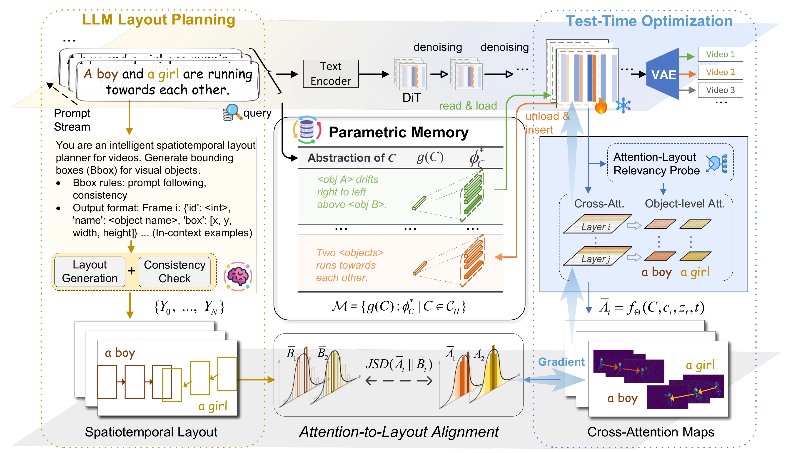
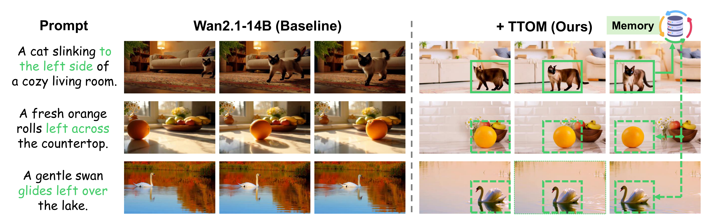

# TTOM: Test-Time Optimization and Memorization for Compositional Video Generation

<p align="center">
  
</p>

<p align="center">
  <strong>TTOM: Test-Time Optimization and Memorization for Compositional Video Generation</strong>
</p>

<p align="center">
  [ICLR 2026] Official repository
</p>

---

## 🔥 News

- **2026-01**: 🎉 TTOM has been **accepted to ICLR 2026**!
- **2025-12**: 🔥 Released inference code. TTOM is **training-free** — no additional model weights or fine-tuning required.

## 🗓️ Todo List

- [x] Release inference code
- [ ] Release evaluation scripts & benchmarks

## 📖 Overview

**TTOM** is a **training-free**, test-time optimization and memorization framework for **compositional video generation**. It addresses the challenge of generating videos with multiple objects, attributes, and motions that faithfully follow complex text prompts — without any additional training or fine-tuning.

The framework operates in two phases:

1. **Meta Extraction & Layout Generation** (`gen_cache`) – Uses GPT-4o to extract object metadata and generate spatial-temporal layouts from text prompts.
2. **Video Generation with TTOM** (`gen_benchmarks`) – Generates videos using [Wan2.1](https://github.com/Wan-Video/Wan2.1) conditioned on extracted metadata and layouts, with iterative test-time optimization of cross-attention via LoRA.

Built on top of [DiffSynth-Studio](https://github.com/modelscope/DiffSynth-Studio), an efficient diffusion inference engine.

## 🎥 Qualitative Results

<p align="center">
  
</p>

<p align="center">
  
</p>

## 🏆 T2V-CompBench Results

Evaluation results of compositional text-to-video generation on [T2V-CompBench](https://arxiv.org/abs/2407.14505), reported over 7 categories and the overall average (Avg.). **Bold** = best, <ins>underline</ins> = second best.

<table>
<thead>
<tr>
<th align="left">Model</th>
<th align="center">Avg.</th>
<th align="center">Motion</th>
<th align="center">Num</th>
<th align="center">Spatial</th>
<th align="center">Con-attr</th>
<th align="center">Dyn-attr</th>
<th align="center">Action</th>
<th align="center">Interact</th>
</tr>
</thead>
<tbody>
<tr><td colspan="9"><em>Commercial</em></td></tr>
<tr>
<td>Pika-1.0</td>
<td align="center">0.3752</td><td align="center">0.2234</td><td align="center">0.3870</td><td align="center">0.4650</td><td align="center">0.5536</td><td align="center">0.0128</td><td align="center">0.4250</td><td align="center">0.5198</td>
</tr>
<tr>
<td>Gen-3</td>
<td align="center">0.4094</td><td align="center">0.2754</td><td align="center">0.2306</td><td align="center">0.5194</td><td align="center">0.5980</td><td align="center">0.0687</td><td align="center">0.5233</td><td align="center">0.5906</td>
</tr>
<tr>
<td>Dreamina 1.2</td>
<td align="center">0.4689</td><td align="center">0.2361</td><td align="center">0.4380</td><td align="center">0.5773</td><td align="center">0.6913</td><td align="center">0.0051</td><td align="center">0.5924</td><td align="center">0.6824</td>
</tr>
<tr>
<td>Kling-1.0</td>
<td align="center">0.4630</td><td align="center">0.2562</td><td align="center">0.4413</td><td align="center">0.5690</td><td align="center">0.6931</td><td align="center">0.0098</td><td align="center">0.5787</td><td align="center">0.7128</td>
</tr>
<tr><td colspan="9"><em>Diffusion UNet-based</em></td></tr>
<tr>
<td>ModelScope</td>
<td align="center">0.3468</td><td align="center">0.2408</td><td align="center">0.1986</td><td align="center">0.4118</td><td align="center">0.5148</td><td align="center">0.0161</td><td align="center">0.3639</td><td align="center">0.4613</td>
</tr>
<tr>
<td>&nbsp;&nbsp;+ LVD</td>
<td align="center">0.3912</td><td align="center">0.2457</td><td align="center">0.2008</td><td align="center">0.5405</td><td align="center">0.5439</td><td align="center">0.0171</td><td align="center">0.3802</td><td align="center">0.4502</td>
</tr>
<tr>
<td>Show-1</td>
<td align="center">0.3676</td><td align="center">0.2291</td><td align="center">0.3086</td><td align="center">0.4544</td><td align="center">0.5670</td><td align="center">0.0115</td><td align="center">0.3881</td><td align="center">0.6244</td>
</tr>
<tr>
<td>VideoTetris</td>
<td align="center">0.4097</td><td align="center">0.2249</td><td align="center">0.3467</td><td align="center">0.4832</td><td align="center">0.6211</td><td align="center">0.0104</td><td align="center">0.4839</td><td align="center">0.6578</td>
</tr>
<tr>
<td>T2V-Turbo-V2</td>
<td align="center">0.4317</td><td align="center">0.2556</td><td align="center">0.3261</td><td align="center">0.5025</td><td align="center">0.6723</td><td align="center">0.0127</td><td align="center">0.6087</td><td align="center">0.6439</td>
</tr>
<tr><td colspan="9"><em>DiT-based</em></td></tr>
<tr>
<td>Open-Sora 1.2</td>
<td align="center">0.3851</td><td align="center">0.2468</td><td align="center">0.3719</td><td align="center">0.5063</td><td align="center">0.5639</td><td align="center">0.0189</td><td align="center">0.4839</td><td align="center">0.5039</td>
</tr>
<tr>
<td>Open-Sora-Plan v1.3</td>
<td align="center">0.3670</td><td align="center">0.2377</td><td align="center">0.2952</td><td align="center">0.5162</td><td align="center">0.6076</td><td align="center">0.0119</td><td align="center">0.4524</td><td align="center">0.4483</td>
</tr>
<tr><td colspan="9"></td></tr>
<tr>
<td>CogVideoX-5B</td>
<td align="center">0.4189</td><td align="center">0.2658</td><td align="center">0.3706</td><td align="center">0.5172</td><td align="center">0.6164</td><td align="center">0.0219</td><td align="center">0.5333</td><td align="center">0.6069</td>
</tr>
<tr>
<td>&nbsp;&nbsp;+ DyST-XL</td>
<td align="center">0.5081</td><td align="center">0.2712</td><td align="center">0.3969</td><td align="center">0.6110</td><td align="center">0.8696</td><td align="center">0.0221</td><td align="center">0.7321</td><td align="center">0.6536</td>
</tr>
<tr>
<td>&nbsp;&nbsp;+ LVD</td>
<td align="center">0.4739</td><td align="center">0.3291</td><td align="center">0.3825</td><td align="center">0.5274</td><td align="center">0.7534</td><td align="center">0.0219</td><td align="center">0.6826</td><td align="center">0.6204</td>
</tr>
<tr style="background-color:#f0f0f0">
<td><b>&nbsp;&nbsp;+ Ours</b></td>
<td align="center"><ins>0.5632</ins></td><td align="center"><ins>0.4351</ins></td><td align="center">0.5081</td><td align="center"><ins>0.6173</ins></td><td align="center"><ins>0.8782</ins></td><td align="center">0.0341</td><td align="center">0.7191</td><td align="center"><ins>0.7502</ins></td>
</tr>
<tr style="background-color:#f0f0f0">
<td><b>&nbsp;&nbsp;%Improve.</b></td>
<td align="center">🟢+34.4</td><td align="center">🟢+63.7</td><td align="center">🟢+37.1</td><td align="center">🟢+19.4</td><td align="center">🟢+42.5</td><td align="center">🟢+55.7</td><td align="center">🟢+34.8</td><td align="center">🟢+23.6</td>
</tr>
<tr><td colspan="9"></td></tr>
<tr>
<td>Wan2.1-14B</td>
<td align="center">0.5314</td><td align="center">0.2696</td><td align="center"><ins>0.5113</ins></td><td align="center">0.5709</td><td align="center">0.8369</td><td align="center">0.0570</td><td align="center">0.7504</td><td align="center">0.7239</td>
</tr>
<tr>
<td>&nbsp;&nbsp;+ LVD</td>
<td align="center">0.5439</td><td align="center">0.2864</td><td align="center">0.4707</td><td align="center">0.5753</td><td align="center">0.8610</td><td align="center"><ins>0.0829</ins></td><td align="center"><ins>0.8107</ins></td><td align="center">0.7201</td>
</tr>
<tr style="background-color:#f0f0f0">
<td><b>&nbsp;&nbsp;+ Ours</b></td>
<td align="center"><b>0.6155</b></td><td align="center"><b>0.4922</b></td><td align="center"><b>0.5881</b></td><td align="center"><b>0.6275</b></td><td align="center"><b>0.8982</b></td><td align="center"><b>0.1182</b></td><td align="center"><b>0.8152</b></td><td align="center"><b>0.7691</b></td>
</tr>
<tr style="background-color:#f0f0f0">
<td><b>&nbsp;&nbsp;%Improve.</b></td>
<td align="center">🟢+15.8</td><td align="center">🟢+82.6</td><td align="center">🟢+15.0</td><td align="center">🟢+9.9</td><td align="center">🟢+7.3</td><td align="center">🟢+107.4</td><td align="center">🟢+8.6</td><td align="center">🟢+6.2</td>
</tr>
</tbody>
</table>

> 💡 TTOM is **training-free**: it applies test-time optimization on top of frozen pre-trained models (CogVideoX-5B, Wan2.1-14B) without any additional training or fine-tuning, yet achieves state-of-the-art compositional video generation.

## 📂 Project Structure

```text
TTOM/
├── generation/
│   ├── gen_cache.py              # Phase 1: Meta extraction and layout generation
│   ├── gen_benchmarks.py         # Phase 2: Video generation with TTOM
│   └── get_attnmap.py            # Attention map generation
├── utils/
│   ├── gdino_detection_video.py  # GroundingDINO object detection + SAM2 segmentation
│   ├── evaluate_miou.py          # mIoU evaluation between attention and masks
│   ├── visualize_attn_maps.py    # Attention map visualization
│   └── ...                       # Other utility functions
├── ttom/                         # Core TTOM implementation
└── scripts/                      # Batch processing scripts
```

## 🛠️ Installation

### Prerequisites

- Python 3.10+
- CUDA-capable GPU (recommended ≥ 24 GB VRAM for Wan2.1-T2V-14B)
- `pip` and a virtualenv/conda environment

> 💡 **Note:** [GroundingDINO](#optional-groundingdino--sam2) and [SAM2](#optional-groundingdino--sam2) are **only required** for attention-layout overlap evaluation. For basic video generation, skip them.

### 1. Install TTOM

```bash
git clone https://github.com/LgQu/TTOM.git
cd TTOM
pip install -r requirements.txt
pip install -e .
```

### 2. Download Wan2.1-T2V-14B

```bash
pip install "huggingface_hub[cli]"
huggingface-cli download Wan-AI/Wan2.1-T2V-14B --local-dir ./models/Wan2.1-T2V-14B
```

> 💡 The download can be large. The model will be saved to `./models/Wan2.1-T2V-14B/`.

### 3. Optional: GroundingDINO & SAM2

<details>
<summary>Click to expand (only needed for attention-layout evaluation)</summary>

**GroundingDINO**

```bash
git clone https://github.com/IDEA-Research/GroundingDINO.git
cd GroundingDINO && pip install -e . && cd ..
```

**SAM2**

```bash
git clone https://github.com/facebookresearch/segment-anything-2.git sam2
cd sam2 && pip install -e . && cd ..
```

</details>

### 4. Configuration

Set up your OpenAI API key for GPT-4o prompt processing:

```bash
export OPENAI_API_KEY="your-api-key-here"
```

On Windows PowerShell:

```powershell
$env:OPENAI_API_KEY = "your-api-key-here"
```

## 🚀 Quickstart

### Step 1: Build Layout Cache

```bash
python generation/gen_cache.py \
    --benchmark_source t2vcompbench \
    --benchmark_type 1_consistent_attr \
    --start_idx 0 \
    --end_idx 199 \
    --skip_if_exists
```

**Outputs:**
- `cache/{benchmark_source}_{benchmark_type}-gpt_4o.json` – enriched prompts, object metadata, and layouts.
- `data/layout/boxes_{cache_name}/layout_{pid}.gif` – layout visualization GIFs.

### Step 2: Generate Videos with TTOM

```bash
python generation/gen_benchmarks.py \
    --pid 0 \
    --cache_type t2vcompbench_motion_binding_gpt-4o \
    --guidance_type lora \
    --target_layers [3] \
    --max_iter 8 \
    --max_guidance_step 5 \
    --max_lora_step 5 \
    --target_modules "cross_attn.q,cross_attn.k,cross_attn.v,cross_attn.o" \
    --jsd_loss_weight 1.0 \
    --min_loss_value 0.06 \
    --save_lora_weight False \
    --skip_existed_prompt False \
    --prefix "test" \
    --strat_id 0
```

**Outputs:**
- `data/benchmarks/{cache_type}/.../{pid}_{tag}.mp4` – generated videos.

## 🔧 Advanced Usage

### Meta Extraction & Layout Generation

Uses GPT-4o to enrich prompts, extract object instances/attributes, and generate spatial-temporal layouts:

```bash
python generation/gen_cache.py \
    --benchmark_source t2vcompbench \
    --benchmark_type 1_consistent_attr \
    --start_idx 0 \
    --end_idx 199 \
    --skip_if_exists
```

### Video Generation with TTOM Strategies

`gen_benchmarks.py` generates videos using Wan2.1 with TTOM-style test-time optimization and memorization:

```bash
python generation/gen_benchmarks.py \
    --pid 0 \
    --cache_type t2vcompbench_motion_binding_gpt-4o \
    --guidance_type lora \
    --target_layers [3] \
    --max_iter 8 \
    --max_guidance_step 5 \
    --max_lora_step 5 \
    --target_modules "cross_attn.q,cross_attn.k,cross_attn.v,cross_attn.o" \
    --jsd_loss_weight 1.0 \
    --com_loss_weight 0.0 \
    --min_loss_value 0.03 \
    --save_lora_weight False \
    --save_mask False \
    --skip_existed_prompt False \
    --prefix "" \
    --strat_id 0
```

<details>
<summary>📋 Full argument reference</summary>

| Argument | Description | Default |
|---|---|---|
| `--pid` | Sample ID to generate | *required* |
| `--cache_type` | Cache file name | `t2vcompbench_motion_binding_gpt-4o` |
| `--guidance_type` | Guidance type: `lora`, `lvd`, `none` | `lora` |
| `--target_layers` | Transformer layers for guidance | `[3]` |
| `--max_iter` | Number of TTOM iterations | `8` |
| `--max_guidance_step` | Max guidance steps per iteration | `5` |
| `--max_lora_step` | Max LoRA update steps per iteration | `5` |
| `--target_modules` | Modules to apply LoRA | `cross_attn.q,cross_attn.k,cross_attn.v,cross_attn.o` |
| `--jsd_loss_weight` | JSD loss weight | `1.0` |
| `--com_loss_weight` | Composition loss weight | `0.0` |
| `--min_loss_value` | Min loss value threshold | `0.03` |
| `--save_lora_weight` | Save LoRA weights | `False` |
| `--save_mask` | Save attention masks | `False` |
| `--skip_existed_prompt` | Skip existing outputs | `False` |
| `--prefix` | Output directory prefix | `""` |
| `--strat_id` | TTOM strategy (0=update, 1=load, 2=load+update) | `0` |

</details>

### Attention Map Analysis

<details>
<summary>Click to expand full evaluation pipeline</summary>

**1. Generate attention maps:**

```bash
bash scripts/run_attnmap_batch.sh
```

> 💡 Before running, configure `CONDA_PYTHON` and `BASE_DIR` in the script.

**2. Run GroundingDINO detection + SAM2 segmentation:**

```bash
python utils/gdino_detection_video.py
```

**3. Compute mIoU:**

```bash
python utils/evaluate_miou.py \
    --attn_dir data/attn_maps/wan21_lora/ \
    --dino_dir data/dino_results_batch/ \
    --output_dir data/miou_summary/
```

**4. Visualize attention maps:**

```bash
python utils/visualize_attn_maps.py \
    --pid 0 \
    --step_id 40 \
    --layer_id 3 \
    --inst_id 0 \
    --save
```

</details>

## 📁 Output Structure

```text
data/
├── attn_maps/            # Attention map files (.pt)
├── dino_results_batch/   # GroundingDINO + SAM2 detection/segmentation results
├── miou_summary/         # mIoU evaluation results and summary stats
├── benchmarks/           # Generated videos
└── layout/               # Layout visualizations (GIFs)
```

## 🙏 Acknowledgements

We thank the authors and maintainers of the following projects:

- [Wan2.1](https://github.com/Wan-Video/Wan2.1) – Open and advanced large-scale video generative models.
- [DiffSynth-Studio](https://github.com/modelscope/DiffSynth-Studio) – Efficient diffusion model inference engine.
- [GroundingDINO](https://github.com/IDEA-Research/GroundingDINO) – Open-set object detection with language grounding.
- [SAM2](https://github.com/facebookresearch/segment-anything-2) – Segment Anything 2 for high-quality segmentation.

## ⭐ Citation

If you find TTOM useful, please consider giving this repository a star ⭐ and citing our paper:

```bibtex
@inproceedings{ttom2026iclr,
  title={TTOM: Test-Time Optimization and Memorization for Compositional Video Generation},
  year={2026},
  booktitle={International Conference on Learning Representations (ICLR)}
}
```
